# Egg Incubator Management System

## Technologies Used
- **Frontend & Backend**: C# Xamarin  
- **Hardware Programming Language**: C++  
- **Database**: Firebase  
- **Hardware Components**: DHT22 sensor, 12V DC motor  
- **Email Integration**: Gmail  

---

## Abstract

Poultry holds a significant position in agriculture and is one of the most consumed products. There is a huge demand for poultry products, and relying on natural methods for hatching eggs has proven inefficient, leading to the development of technologies to increase poultry production.

This project focuses on the development of an egg incubator management system for Zaone Poultry Farm. The design ensures optimal environmental conditions for successful egg hatching. Key parameters such as temperature, humidity, and egg rotation are maintained at optimal levels to enhance hatchability rates.

The system integrates multiple technologies, including sensors and microcontrollers. The microcontrollers control environmental conditions like temperature and humidity based on user input or feedback from sensors such as the DHT22. The system can be remotely monitored via an Android or desktop application.

Chicken eggs will be used as a case study to test and evaluate the system, with a strong assurance that it can accurately hatch eggs while preventing potential problems that might harm them.
 

# 1. Appendices

## 1.1 Appendix A – User Manual

### System Overview

This system was built to assist farmers at Zaone Poultry Farm in managing egg incubation through automated temperature, humidity, and rotation monitoring using sensors and microcontrollers.

---

### 1. Create Account

The user begins by creating an account using the registration form.

- **Figure 1.1** shows the initial registration interface.
- **Figure 1.2** shows the completed form before submission.

  

---

### 2. Login

After registration, the user logs into the system.

- **Figure 2.1** displays the login form.
- **Figure 2.2** confirms the login process upon successful entry of credentials.

  

---

### 3. Navigation Menu

The user is guided through the application via a sidebar menu.

- **Figure 3.1** shows the default navigation layout.

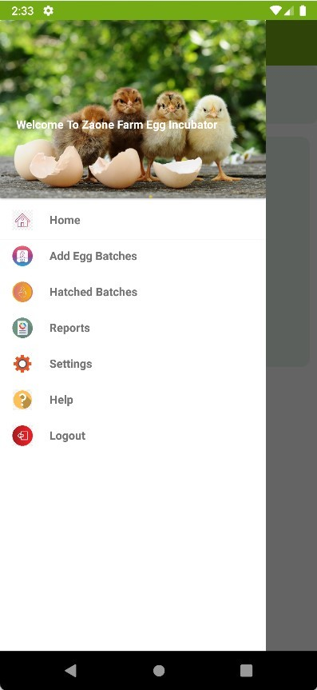

---

### 4. Add or Select Incubator

Users can add new incubators or select from previously saved ones.

- **Figure 4.1** shows the add incubator form.
- **Figure 4.2** shows incubator selection.

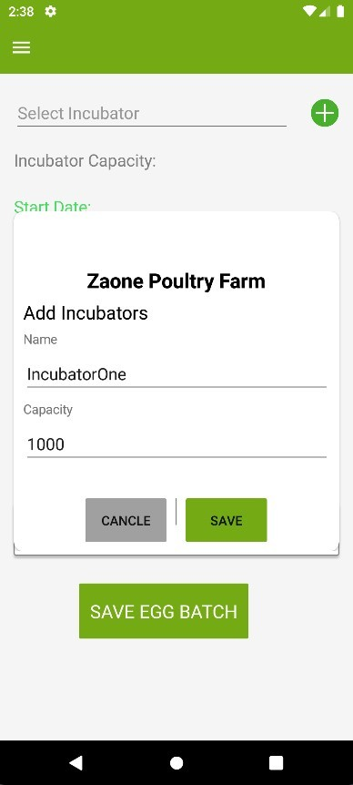  
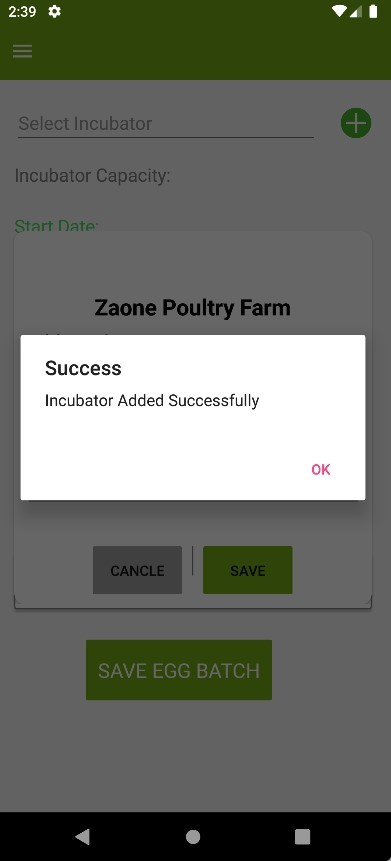

---

### 5. Add Egg Batch

Users input the number of eggs for incubation.

- **Figure 5.1** shows the egg batch entry interface.
- **Figure 5.2** displays eeg batch added.
- **Figure 5.3** displays an error when egg count exceeds capacity.

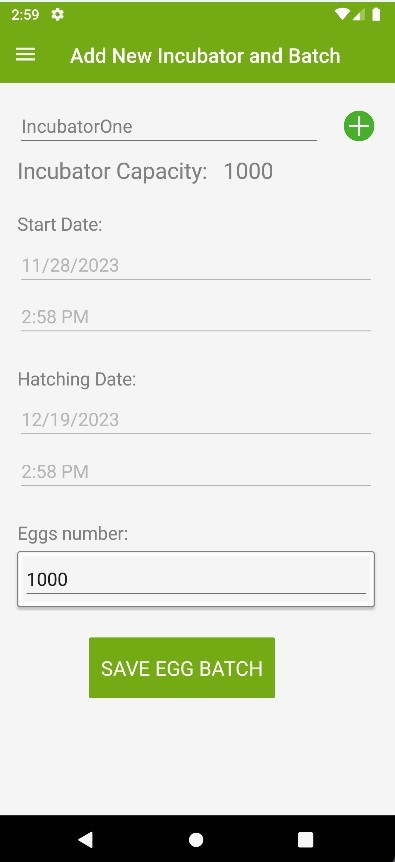  
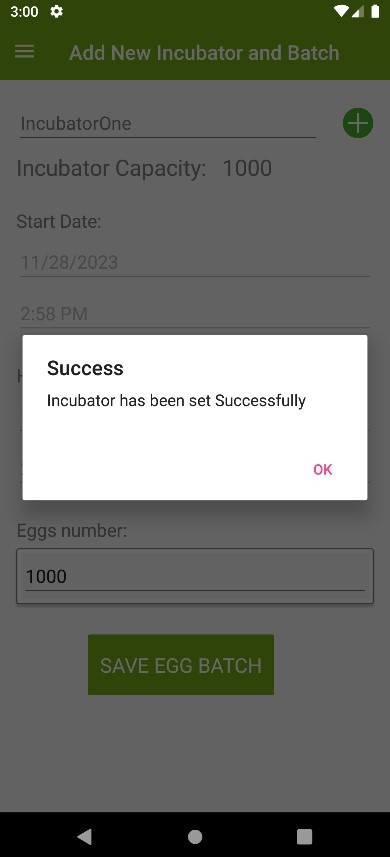
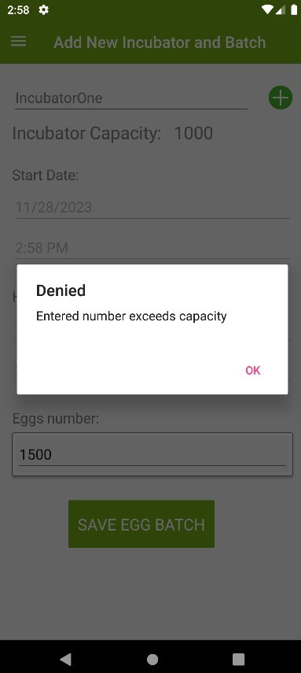

---

### 6. View Incubators

Users can view all incubators and their statuses.

- **Figure 6.1** shows a list of incubators.

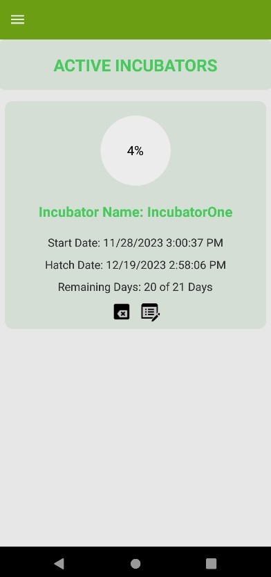  

---

### 7. Set Temperature and Humidity

Farmers configure the required environmental conditions.

- **Figure 7.1** shows the threshold settings input.
- **Figure 7.2** confirms saved values in Firebase.

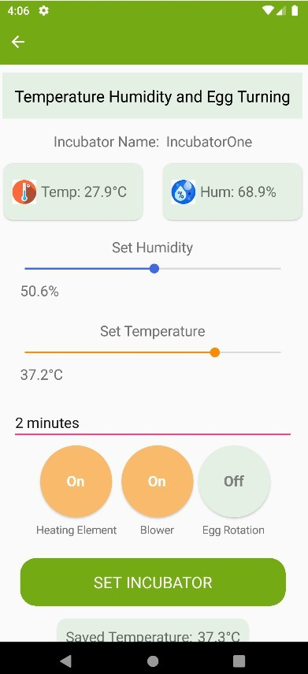  
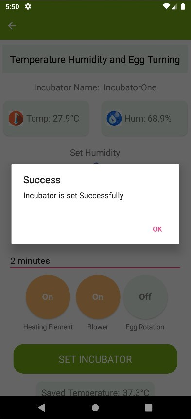

---

### 8. View Designed Incubator

The physical incubator and its parts are shown.

- **Figure 8.1** shows the external and incubator design.
- **Figure 8.2** displays the internal components.

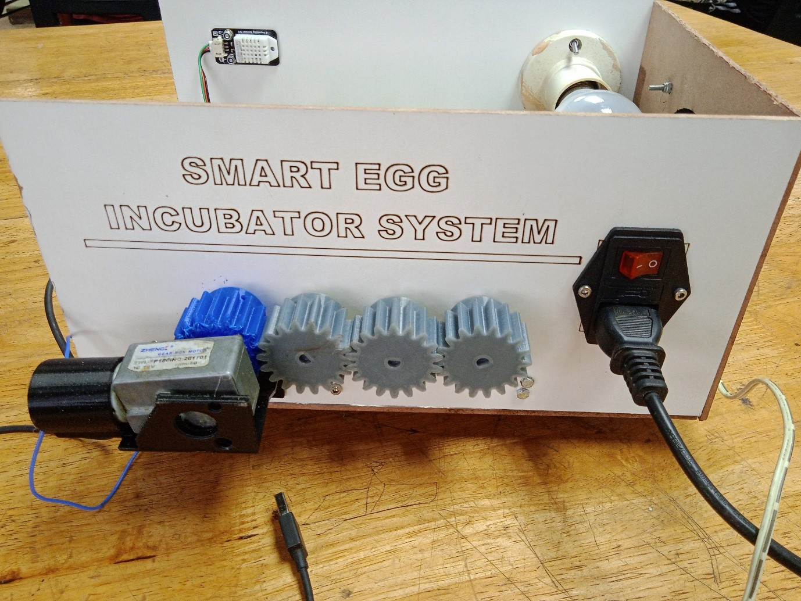  
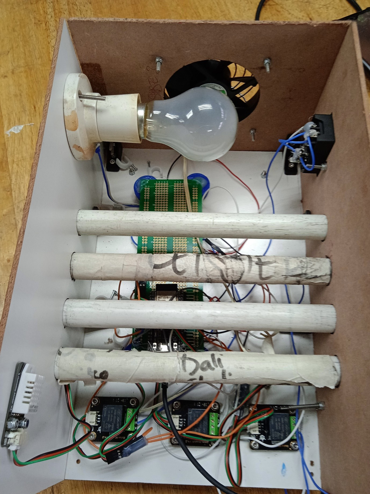

---

### 9. Humidity and Blower Function

The system uses humidity readings to control a blower.

- **Figure 9.1** shows the blower attached inside the incubator.

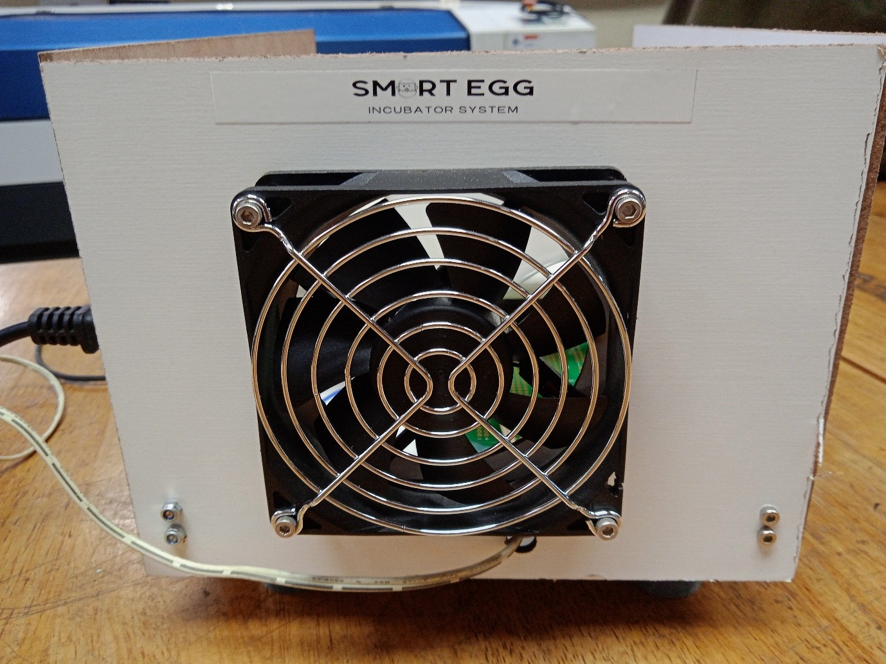  

---

### 10. Temperature Control

The heater responds to temperature thresholds.

- **Figure 10.1** shows the heater turned off at high temp.
- **Figure 10.2** shows the heater turned on at low temp.

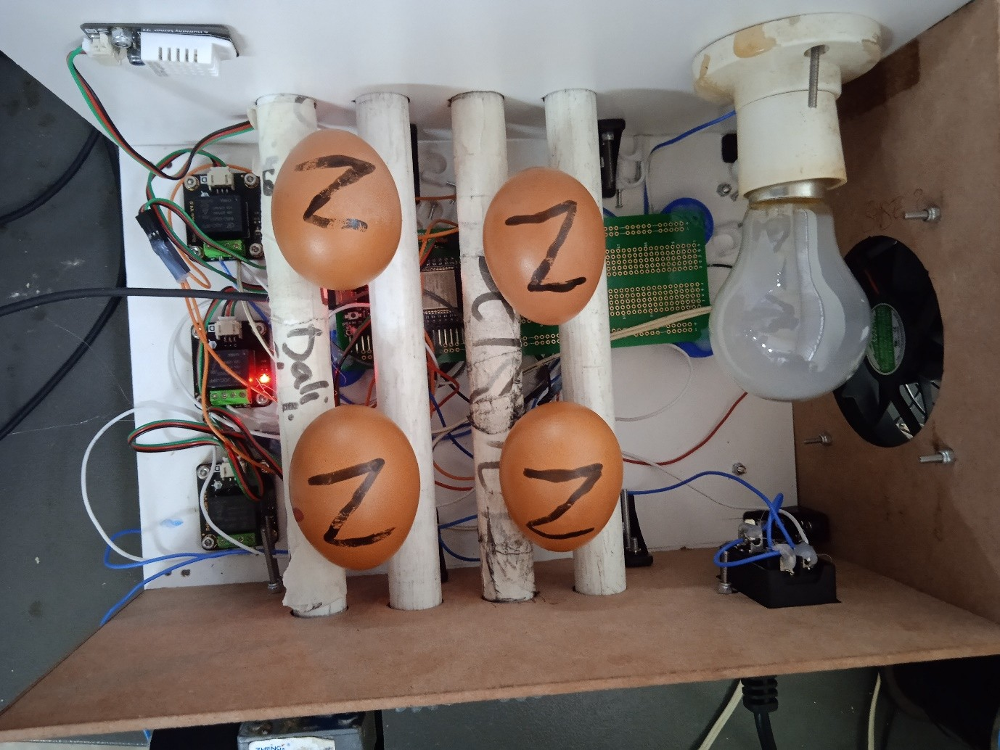  
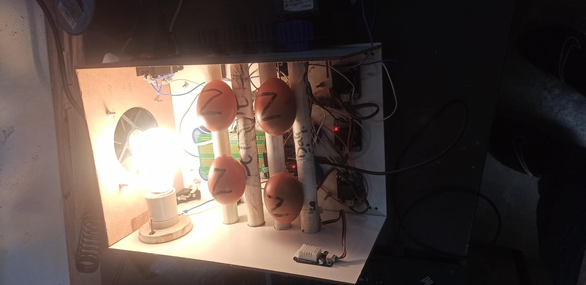

---

### 11. Temperature Monitoring

Temperature is measured using DHT22 sensor.

- **Figure 11.1** shows real-time temperature reading and increased temperature using a lighter.

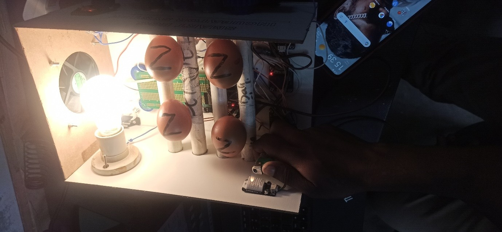  

---

### 12. Humidity Monitoring

Humidity levels are tracked similarly using DHT22.

- **Figure 12.1** shows sensor-based humidity readings and increased humidity using ice blocks.

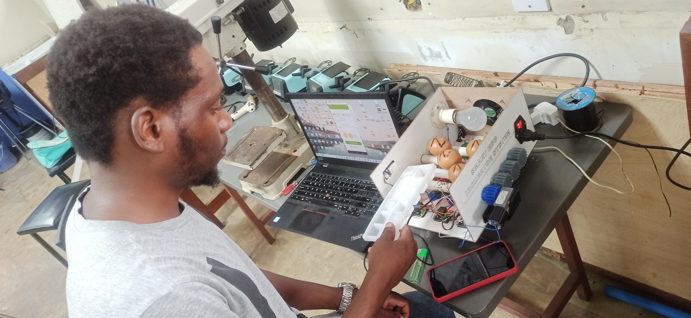

---

### 13. Egg Rotation

The incubator rotates eggs automatically.

- **Figure 13.1** shows an rotation cycle.
  
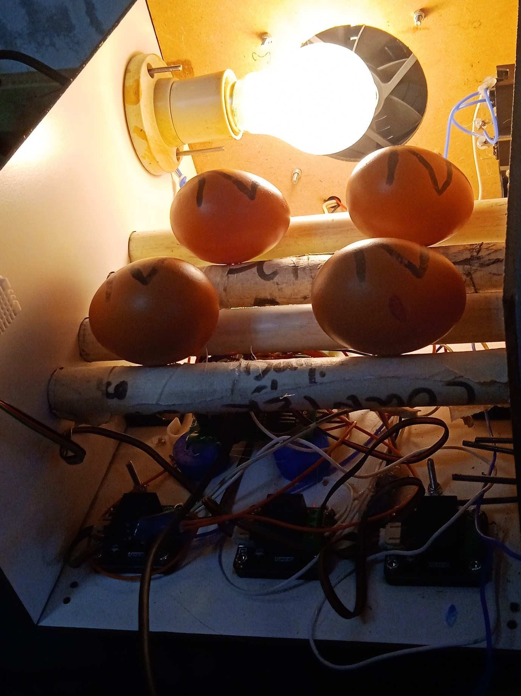

---

### 14. Email Notification

The system sends an email at the end of the hatching cycle.

- **Figure 14.1** shows the notification email.

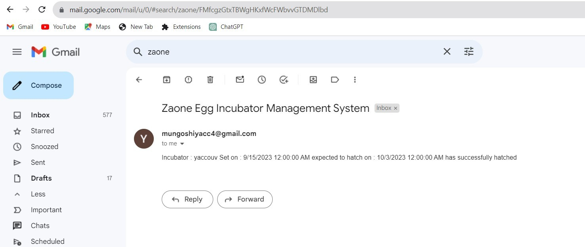  

---

### 15. Input Hatched Eggs

After the hatching cycle, users input hatch results.

- **Figure 15.1** shows the hatched input form.

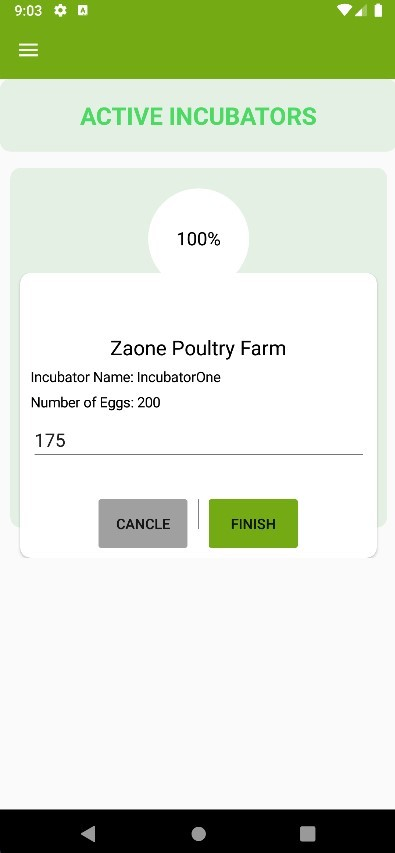  

---

### 16. View Reports

The system generates visual analytics of hatchability.

- **Figure 16.1** shows a 21-day line chart for temperature and humidity.
- **Figure 16.2** shows a pie chart summarizing hatchability rate.

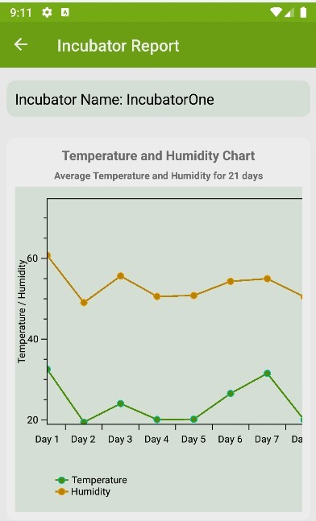  
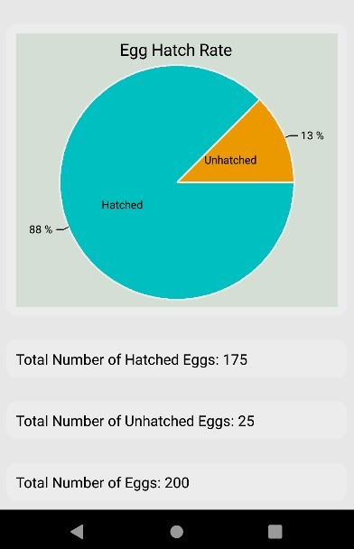
